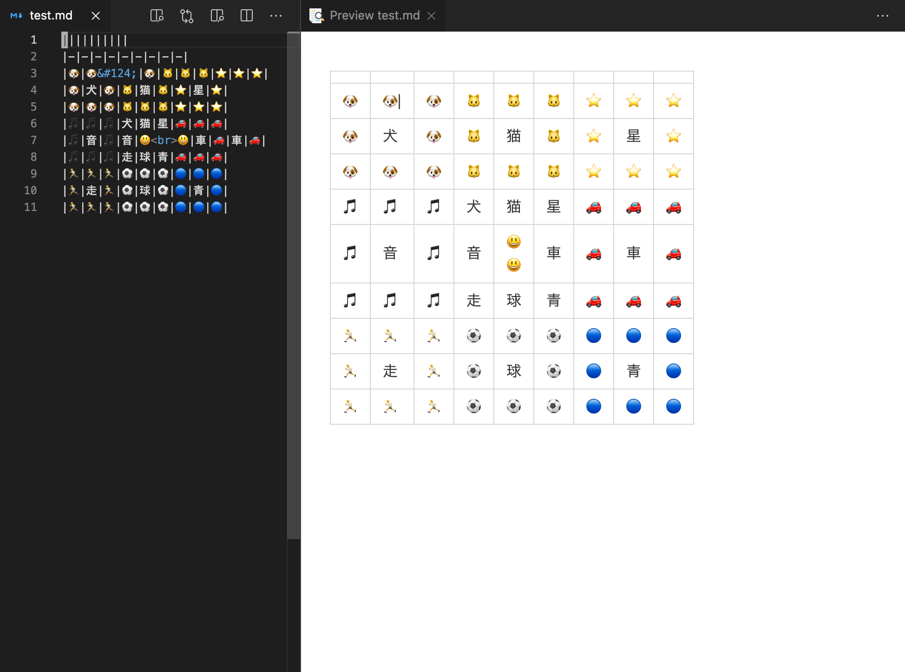

# gridtodo
`gridtodo`: Convert yaml to grid todo with markdown table format



`gridtoto` is a command line tool to create a matrix composed of cells (Mandal-Art), which displaying relevant keywords you come up with, from a yaml file. `gridtodo` command generate a matrix of keywords with markdown table format.

## Usage

### gridtodo help or gridtodo -h
```
gridtodo:
        gridtoto is a command line tool to create a matrix composed of cells (Mandal-Art),
        which displaying relevant keywords you come up with, from a yaml file.
        gridtodo command generate a matrix of keywords with markdown table format.

Usage:
  gridtodo [flags]
  gridtodo [command]

Available Commands:
  generate    Generate a yaml file (default is todo.yaml) for markdown table
  help        Help about any command
  show        Convert yaml to markdown table

Flags:
  -h, --help     help for gridtodo

Use "gridtodo [command] --help" for more information about a command.
```

### Generate template yaml file
Default file name is todo.yml

```
$ gridtodo generate
$ head todo.yml
goal: ""
panel:
- cell:
  - ""
  - ""
  - ""
  - ""
  - ""
  - ""
  - ""
```

### Convert yaml file to markdown table format
After edit yaml file generated above, convery it to markdown table by the following command
```
$ gridtodo show todo.yml
[display markdown table]
```

To preview the results, redirect to markdown file
```
$ gridtodo show todo.yml > todo.md
```

## License

MIT

